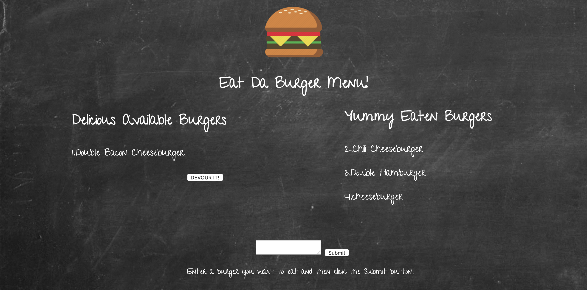

# Eat Da Burger

<h4> Eat Da Burger app creates a burger logger utlizing MySQL, Node, Express, Handlebars and ORM. Have fun and add burgers and devour them! </h4>

<ul> 

<li> The main purpose of the application is to take in the input specified for the type of burger and display them in the Delicious Available Burgers list. If the user decides they would like to eat a particular burger, they can click on the Devour It button and the burger will now be placed in the Yummy Eaten Burgers list. </li> </ul>  

<a href="https://shielded-eyrie-59960.herokuapp.com/"> Heroku App Link </a>

 

<footer> This assignment was created by Elizabeth Bodzy for SMU Coding Bootcamp </footer>

